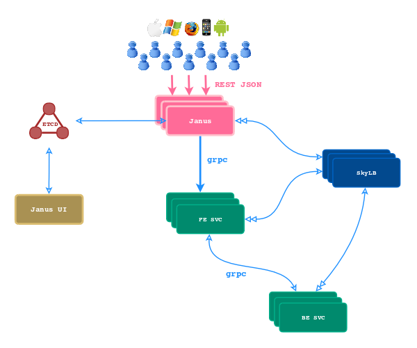
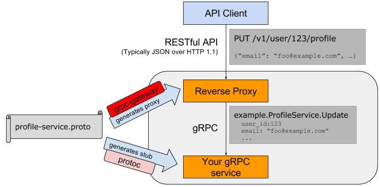
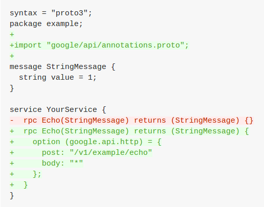
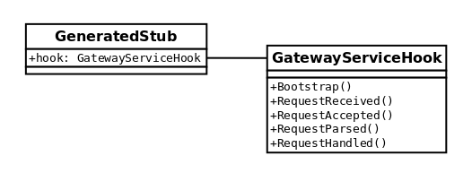
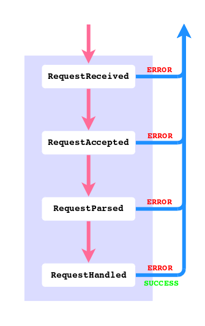
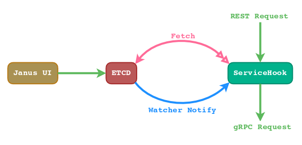

# Janus-gatway - Enterprise Universal Gateway Service

`janus-gateway` is a enterprise universal gateway service for mobile, native, and web apps.
It's based on `grpc-gateway` and mobile team's gateway development experience.

## Overview

`janus-gateway` is a thin gateway layer on top of all front-end or APIs services. It's the single entrance for all enterprise internal services except the connection services (such as EIM connection layer, SSO, etc.). All clients access the gateway (through the reverse proxy or load balancer) with RESTful APIs, the gateway translates the requests to gRPC calls to the target services.



>  SkyLB is an external load balancer for gRPC which is able to load balance on
> gRPC's long-lived connections. `janus-gateway` instances connect to SkyLB for endpoints
> of the target services, and load balance the end-users' requests to the target
> services.

Based on this structure, `janus-gateway` provides foundamental functions to enterprise
infrastructure such as user identity verification, API management, monitoring,
and logging.

## How does Janus-gateway Work?

`janus-gateway` is based on the open-sourced `grpc-gateway` framework. The following
diagram shows how grpc-gateway works:



>  So the first step starts from a protocol buffer definition file (written by
> the target service's owner). For each gRPC service defined in the file, an
> annotation can be added to describe its RESTful properties:



The above code specifies that the client can call a RESTful API
"https://apis.xxx.com/v1/example/echo" which is a HTTP POST and the
request and response will be JSON objects.

Once we have the proto file, grpc-gateway translates the RPC methods to both
gateway and gRPC service stubs in Golang. The generated code can be easily
hooked up with a HTTP server, and when HTTP requests arrive, it issues gRPC
calls to the target service.

`janus-gateway` is the project to create such a HTTP server to meet enterprise business
needs.

### Request Interception

To make it easier to inject our business logic to the generated gateway stub,
we modified the `grpc-gateway` template with a GatewayServiceHook interface:



Four request hook functions are put in the proper places of the generated
code:



- RequestReceived()

	The request just arrived at the gateway but the JSON payload has not
	been unmarshaled. It's intended for operations like user identity
	verification in which the information in the JSON payload is not needed.

- RequestAccepted()

	The request has been verified with legal user identity, but the JSON
	payload has not yet been unmarshaled. It's the good place for
	extracting user/enterprise information and return them in a map.

- RequestParsed()

	The JSON payload has been unmarshaled.

- RequestHandled()

	The request has been handled, whether it failed or succeeded. Logging
	can be done in this function.

### Service Register/Discovery with SkyLB

SkyLB is enterprise external load balancer for gRPC services. When `grpc-gateway`
translates the proto, it also generates a SkyLB client for each service. The
SkyLB clients talk to the SkyLB to fetch service endpoints, and get notified
when the service endpoints were changed so that it can do client side load
balance properly. A typical SkyLB client example can be found at
[janus-gateway demo](https://github.com/binchencoder/janus-gateway/tree/master/examples/gateway) (it also contains the `grpc-gateway` example).

The GatewayServiceHook provides a Bootstrap() method for us to do
initialization work (triggered by calling runtime.SetGatewayServiceHook() of
`grpc-gateway`). In Bootstrap() we can create gRPC client for each service:

```go
svc.Register(context.Background(), gh.mux, gh.host, opts)
if enabled_in_etcd {
	svc.Enable() // Enable() creates a gRPC client.
} else {
	svc.Disable() // Disable() destroies the gRPC client.
}
```

Thus we can enable/disable the APIs through ETCD. To keep fresh with service
configs in ETCD, Janus should maintain a watcher to ETCD instance. See next
section "Service Keeper" for more details.

### Service Keeper

Service information like enabled/disabled are configured as ETCD keys. Janus
UI provides a user friendly interface to manage these keys. In Bootstrap()
method we need to fetch service information from ETCD, and then create an ETCD
watcher to get notified when service config changes.



The service hook should cache the services information in memory, and handle
requests according to the information. For those services which are not
yet exiting in ETCD, default values are returned (so that such services are
disabled by default).

Note that ETCD v3 watcher itself is a gRPC stream call so it has ignorable
connection overhead (long-live connection) and very low latency.

### Customized Annotations

#### Service IDs/Names

All enterprise gRPC services should be registered with distinct enums in
[gateway-proto/data/data.proto](https://github.com/binchencoder/gateway-proto/tree/master/data/data.proto). The enum value would be the service
ID. For a service enum MY_SERVICE, its service name would be
"my-service". 

> You can define a utility library to convert the service ID from/to service names.

In gRPC service proto, engineers need to specify the service ID like this:

```proto
import "options/extension.proto";

service Demo {
	option (janus.api.service_spec) = {
		service_id: JANUS_GATEWAY_DEMO
		namespace: "default"
		port_name: "grpc"
	}
	// RPC definitions below.
}
```

The service spec is used by `grpc-gateway` to connect to SkyLB server and create
gRPC clients.

#### Field Validation

When `grpc-gateway` translates the proto, it also generates validation logic
for certain fields in request. If the validation failed, it returns HTTP 400
(BAD REQUEST) directly to the caller.

Engineers can annotate some fields as follows:

```proto
import "httpoptions/annotations.proto";

// The request message for greeting.
message GreetingRequest {
	string name = 1 [
		 (janus.api.rules) = {
			rules: {
				type: STRING,
				operator: NON_NIL,
			},
			rules: {
				type: STRING,
				function: TRIM,
				operator: LEN_GT,
				value: "5",
			},
			rules: {
				type: STRING,
				function: TRIM,
				operator: LEN_LT,
				value: "21",
			}
		}
	];
}
```

The above option specifies that field "name" is a string with at least 5 chars
and at most 20.

### Monitoring with Prometheus

For commonly used monitoring metrics, we can rely on the existing
instrumentation in SkyLB client: QPS, latency, and error rate.

We can add Janus customized instrumentation if needed.

## Gateway Rollout Procedure

When a new target service or service update is going to be added to `janus-gateway`,
it has to following the following steps:

1. Add a service enum if it's a new service.

2. Change the proto file and create gateway bazel build target.

3. Implement the gRPC service and push to production.

4. Link the service to gateway if it's a new service. This can be easily done
	by adding an anonymous import in `//janus-gateway/cmd/gateway/registryprod.go ` :
	
	```go
	import (
		_ "github.com/binchencoder/janus-gateway/proto/examples"
	)
	```
	
5. Rebuild the `janus-gateway` binary and push to production.


## References

https://github.com/grpc-ecosystem/grpc-gateway

https://github.com/binchencoder/grpc-skylb